# Intune Endpoint Compliance & Configuration Baseline

A production-realistic Intune deployment built on a dedicated Microsoft 365 / Azure tenant (Antsys Technologies LLC), demonstrating end-to-end device compliance management: enrollment, policy enforcement, automated reporting via Microsoft Graph, centralized telemetry in Azure Log Analytics using the modern Logs Ingestion API, and automated alerting on non-compliant devices.

## Project Overview

This project simulates a small-business endpoint management deployment, covering the full lifecycle from device enrollment through automated, alerting-driven compliance monitoring. Rather than a one-off script or manual checks, the goal was to build something closer to how a production environment would actually operate: scheduled automation, centralized logging, and alerts that fire when something needs attention.

The project also serves as a hands-on deep dive into the Azure Monitor Logs Ingestion API and Data Collection Rules (DCRs) — the current, supported approach to custom log ingestion, as opposed to the deprecated HTTP Data Collector API.

## Architecture

```
Windows Device (Entra-registered)
        |
        | Intune compliance policy + Settings Catalog profile
        v
   Microsoft Intune (MDM)
        |
        | MS Graph API (Get-IntuneComplianceReport.ps1)
        v
  PowerShell Reporting Script
        |
        | Logs Ingestion API (Bearer token auth)
        v
Data Collection Endpoint (DCE)
        |
        | Data Collection Rule (DCR) - schema + KQL transform
        v
Log Analytics Workspace (IntuneCompliance_CL)
        |
        | Scheduled query (every 5 min)
        v
   Azure Monitor Alert Rule
        |
        v
   Action Group -> Email Notification
```

Automation is handled by Windows Task Scheduler, which runs the reporting script daily.

## Technologies Used

- **Microsoft Intune** — device enrollment, compliance policies, Settings Catalog configuration profiles
- **Entra ID (Azure AD)** — device registration, dynamic security groups
- **Microsoft Graph API** — application registration with client credentials flow, PowerShell automation
- **Azure Log Analytics** — custom log table (`IntuneCompliance_CL`) with explicit schema
- **Azure Monitor — Data Collection Endpoints & Data Collection Rules** — modern Logs Ingestion API pipeline with KQL-based transforms
- **Azure Monitor Alerts** — scheduled KQL query alerts with action groups
- **Azure CLI** — full infrastructure provisioning (table, DCE, DCR, role assignments) via command line
- **PowerShell 7 / Microsoft.Graph module** — compliance data collection and shipping
- **Windows Task Scheduler** — daily automated execution

## What Was Configured

### Device Enrollment

The test device was registered to Entra ID and enrolled into Intune (Entra-registered / Workplace-joined). Enrollment restrictions were configured with a maximum device limit, and a dynamic security group (`Intune-Windows-Devices`) was created to automatically capture all enrolled Windows devices using the dynamic membership rule:

```
(device.deviceOSType -eq "Windows")
```

### Compliance Policy

A Windows compliance policy (`Antsys-Windows-Compliance-Baseline`) was created and assigned to the dynamic device group, enforcing:

| Setting | Requirement |
|---|---|
| BitLocker | Required |
| Secure Boot | Required |
| Minimum OS version | 10.0.19041 |
| Password | Required, minimum 12 characters |
| Firewall | Required |
| Antivirus | Required |
| Real-time protection | Required |

Devices that fail to meet these requirements are marked non-compliant immediately.

### Configuration Profile

A Settings Catalog configuration profile (`Antsys-Windows-Security-Config`) was deployed to the same group, actively enforcing:

- Device Lock — password enabled
- Microsoft Defender — real-time monitoring allowed
- SmartScreen — enabled in shell
- Telemetry — set to minimum (Security level)

### Compliance Reporting (Microsoft Graph)

An app registration (`Intune-Graph-Reporter`) was created with `DeviceManagementManagedDevices.Read.All` and `DeviceManagementConfiguration.Read.All` application permissions (admin-consented). A PowerShell script (`Get-IntuneComplianceReport.ps1`) authenticates using client credentials and queries `deviceManagement/managedDevices` via Graph, producing a CSV report and shipping the same data to Log Analytics.

## Telemetry Pipeline — Logs Ingestion API (DCR-Based)

The original project plan called for the legacy HTTP Data Collector API. During implementation, that approach was abandoned after testing revealed a significant limitation: the Data Collector API auto-creates a "classic" custom log table and silently accepts malformed payloads — data shipped successfully (HTTP 200) but custom fields never populated in the table, leaving only default columns.

This was rebuilt using the **Logs Ingestion API with a Data Collection Rule (DCR)**, which is the current Microsoft-recommended approach for custom log ingestion. Unlike the legacy API, the DCR validates and transforms incoming data against an explicit schema before it reaches the table — failures are visible rather than silent.

### Components (all provisioned via Azure CLI)

**1. Custom Log Analytics table** (`IntuneCompliance_CL`) with explicit schema:

```bash
az monitor log-analytics workspace table create \
  --resource-group rg-intune-monitoring \
  --workspace-name law-antsys-intune \
  -n IntuneCompliance_CL \
  --retention-time 4 \
  --columns DeviceName=string TimeGenerated=datetime OperatingSystem=string ComplianceState=string LastSyncDateTime=datetime
```

**2. Data Collection Endpoint (DCE)** — the ingestion entry point:

```bash
az monitor data-collection endpoint create \
  -g rg-intune-monitoring -l eastus \
  -n dce-intune-monitoring \
  --public-network-access Enabled
```

**3. Data Collection Rule (DCR)** — defines the input stream schema, the KQL transform, and the destination table:

```json
{
  "location": "eastus",
  "properties": {
    "dataCollectionEndpointId": "/subscriptions/<sub-id>/resourceGroups/rg-intune-monitoring/providers/Microsoft.Insights/dataCollectionEndpoints/dce-intune-monitoring",
    "streamDeclarations": {
      "Custom-IntuneCompliance": {
        "columns": [
          { "name": "DeviceName", "type": "string" },
          { "name": "OperatingSystem", "type": "string" },
          { "name": "ComplianceState", "type": "string" },
          { "name": "LastSyncDateTime", "type": "datetime" }
        ]
      }
    },
    "destinations": {
      "logAnalytics": [
        {
          "workspaceResourceId": "/subscriptions/<sub-id>/resourceGroups/rg-intune-monitoring/providers/Microsoft.OperationalInsights/workspaces/law-antsys-intune",
          "name": "law-antsys-intune-dest"
        }
      ]
    },
    "dataFlows": [
      {
        "streams": ["Custom-IntuneCompliance"],
        "destinations": ["law-antsys-intune-dest"],
        "transformKql": "source | extend TimeGenerated = todatetime(LastSyncDateTime)",
        "outputStream": "Custom-IntuneCompliance_CL"
      }
    ]
  }
}
```

```bash
az monitor data-collection rule create \
  --resource-group rg-intune-monitoring --location eastus \
  --name dcr-intune-compliance --rule-file dcr-intune-compliance.json
```

**4. Role assignment** — granting the app registration permission to publish to the DCR:

```bash
az role assignment create \
  --assignee <Intune-Graph-Reporter-App-ID> \
  --role "Monitoring Metrics Publisher" \
  --scope /subscriptions/<sub-id>/resourceGroups/rg-intune-monitoring/providers/Microsoft.Insights/dataCollectionRules/dcr-intune-compliance
```

### Script: Sending Data

The reporting script authenticates to `https://monitor.azure.com` using the same app registration credentials (client credentials flow), then POSTs the compliance report directly to the DCE's Logs Ingestion endpoint:

```powershell
# Token request
$tokenBody = @{
    grant_type    = "client_credentials"
    client_id     = $AppId
    client_secret = $AppSecret
    scope         = "https://monitor.azure.com/.default"
}
$tokenResponse = Invoke-RestMethod -Uri "https://login.microsoftonline.com/$TenantId/oauth2/v2.0/token" -Method POST -Body $tokenBody
$accessToken = $tokenResponse.access_token

# Send to DCE -> DCR -> table
$headers = @{ "Authorization" = "Bearer $accessToken" }
$json = ConvertTo-Json @($report) -Depth 3
$ingestionUri = "https://dce-intune-monitoring-ty7c.eastus-1.ingest.monitor.azure.com/dataCollectionRules/<dcr-immutable-id>/streams/Custom-IntuneCompliance?api-version=2023-01-01"
Invoke-RestMethod -Uri $ingestionUri -Method Post -ContentType 'application/json' -Headers $headers -Body $json
```

### A Note on Field Casing

Microsoft Graph returns device properties in camelCase (`deviceName`, `operatingSystem`, `complianceState`, `lastSyncDateTime`), while the DCR schema and `transformKql` use PascalCase. KQL field matching during the DCR transform is case-sensitive — a mismatch here results in the transform silently failing to populate fields and `TimeGenerated` falling back to ingestion time rather than the device's actual last sync time.

The fix was applied in PowerShell, remapping Graph's output to PascalCase before serialization:

```powershell
$report = $devices | Select-Object `
    @{N='DeviceName'; E={$_.deviceName}}, `
    @{N='OperatingSystem'; E={$_.operatingSystem}}, `
    @{N='ComplianceState'; E={$_.complianceState}}, `
    @{N='LastSyncDateTime'; E={$_.lastSyncDateTime}}
```

## Alerting

An Azure Monitor alert rule (**Non-Compliant Device Detected — Intune**) runs a scheduled KQL query against the workspace every 5 minutes, with a 15-minute lookback:

```kql
IntuneCompliance_CL
| where ComplianceState == 'noncompliant'
| summarize NonCompliantCount = count()
| where NonCompliantCount > 0
```

If the threshold (`NonCompliantCount > 0`) is met, the alert fires (Severity 2 — Warning) and triggers an action group (`ag-intune-compliance`) that sends an email notification.

## Automation

The full reporting and ingestion pipeline runs unattended via Windows Task Scheduler:

- **Task**: `Intune-Daily-Compliance-Report`
- **Trigger**: Daily, 8:00 AM
- **Action**: `powershell.exe -ExecutionPolicy Bypass -File "C:\Scripts\Get-IntuneComplianceReport.ps1"`

Each run produces a timestamped CSV report locally and ships the same data to Log Analytics, where it's immediately available to the alert rule.

## Screenshots

| # | Description |
|---|---|
| 01 |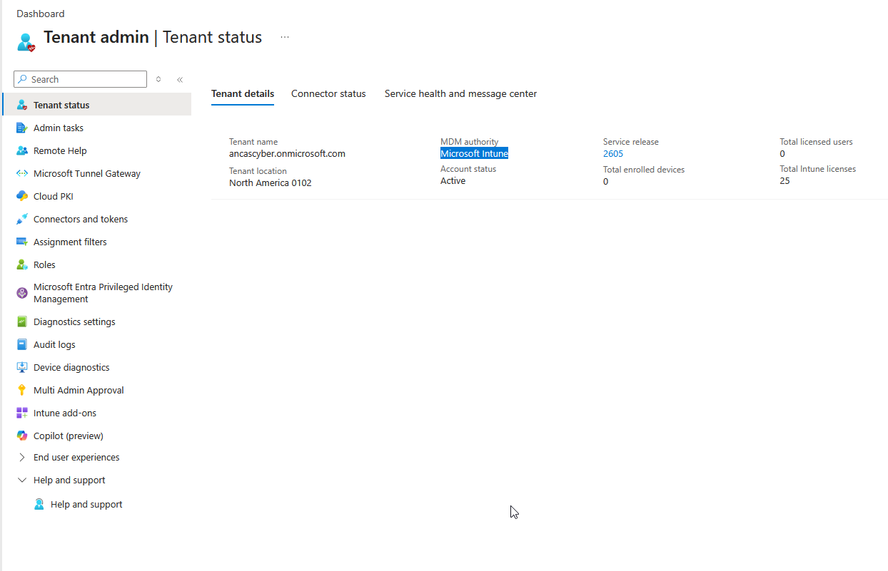
| 02 | 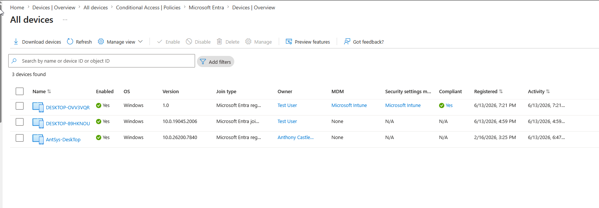
| 03 | 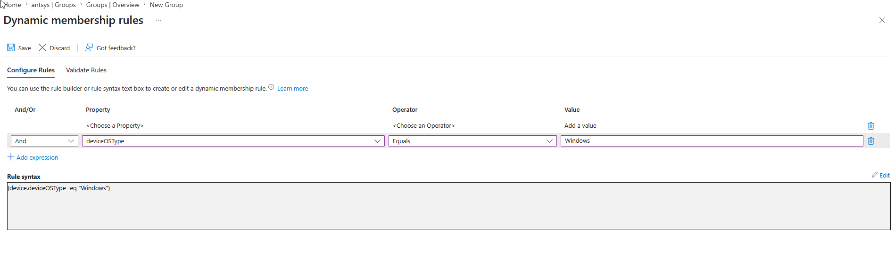
| 04 | 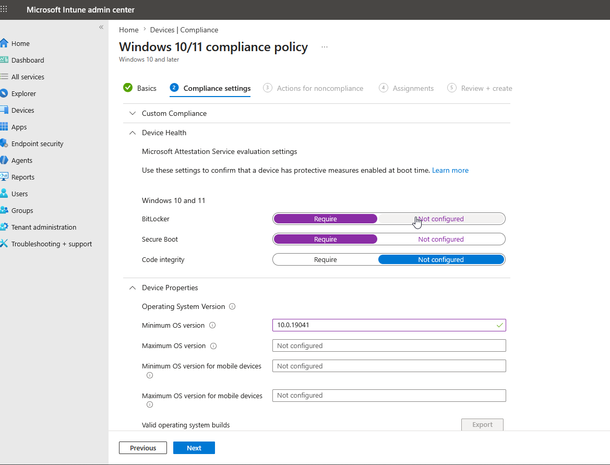
| 05 | 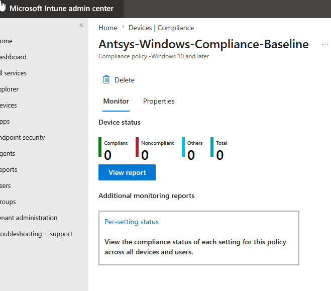
| 06 | 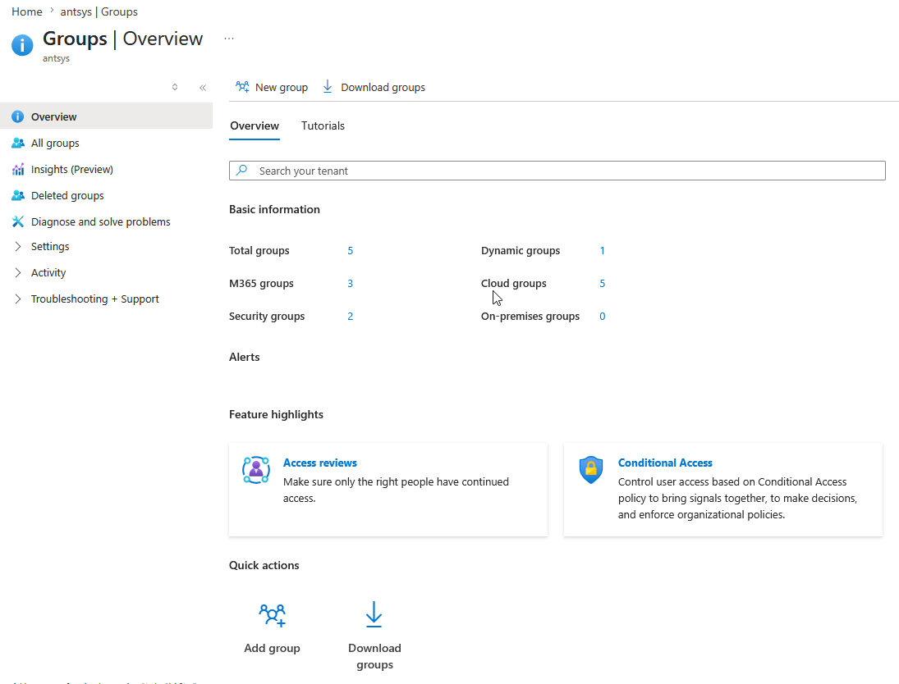 |
| 07 | 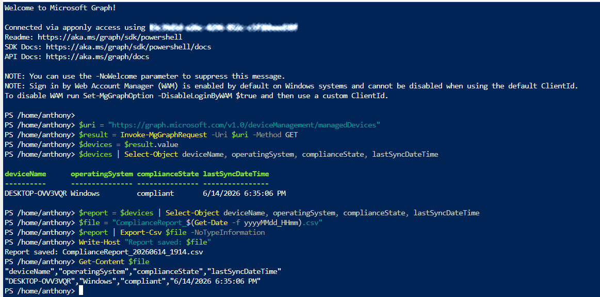
| 08 | 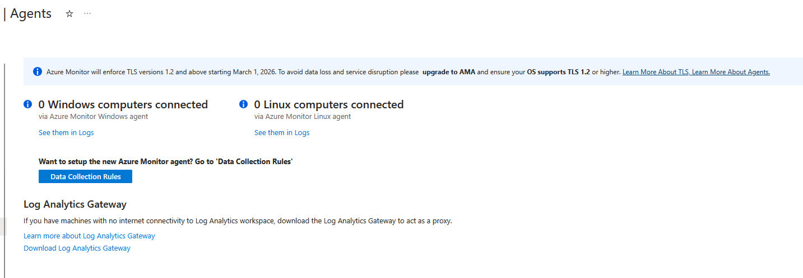
| 09 | 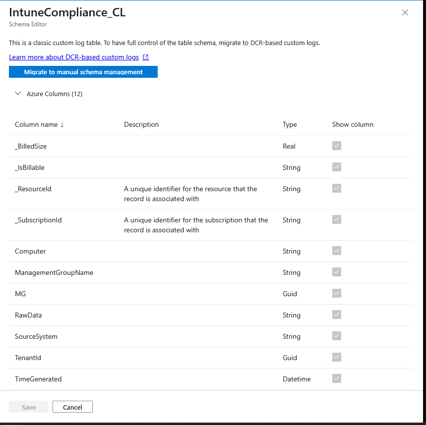
| 10 | 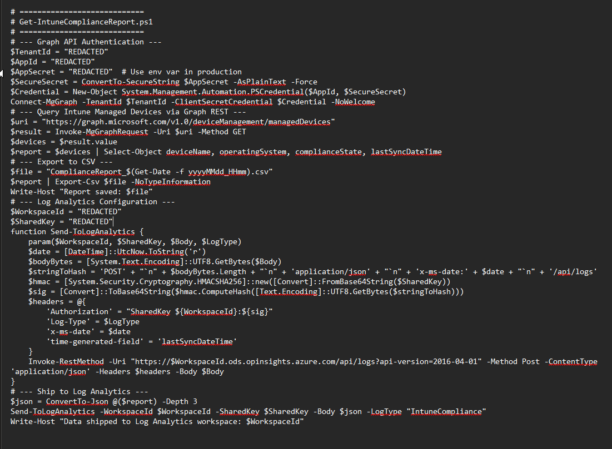
| 11 | 
| 12 | 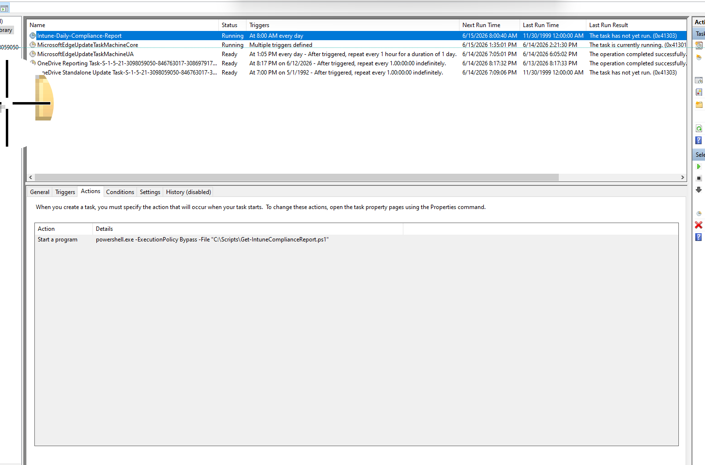

*(Screenshots to be added from project OneNote.)*

## Lessons Learned

The most valuable part of this project wasn't the part that worked on the first try — it was debugging why the legacy HTTP Data Collector API returned successful HTTP responses while silently failing to populate any usable data. That dead end forced a rebuild using the current Logs Ingestion API and DCR architecture, which is both more robust (explicit schema validation) and more representative of how this would be built in a production environment today.

The second major lesson was around field casing: Microsoft Graph's camelCase output and a PascalCase DCR schema don't reconcile automatically, and KQL's case sensitivity means this kind of mismatch fails silently rather than throwing an error — a detail that's easy to miss without checking actual table contents after a "successful" run.

## Repository Structure

```
intune-compliance-baseline/
  README.md
  scripts/
    Get-IntuneComplianceReport.ps1
  infra/
    dcr-intune-compliance.json
  screenshots/
    01-mdm-authority.png
    02-device-enrolled.png
    03-dynamic-group.png
    04-compliance-policy.png
    05-device-compliance-status.png
    06-config-profile-succeeded.png
    07-graph-script-output.png
    08-log-analytics-workspace.png
    09-kql-query-results.png
    10-dcr-dce-config.png
    11-alert-rule-config.png
    12-task-scheduler.png
```
